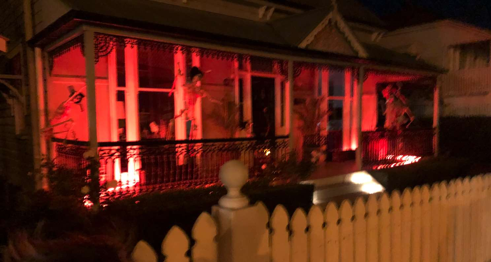

# ESP8266 FauxmoESP Fireplace Effect

## Overview
This project uses an ESP8266 running fauxmoESP to create a realistic fireplace effect with a NeoPixel LED strip. It can be controlled via Phillips Hue emulation (for use in smart homes such as Alexa voice commands).

## Features
- Realistic fireplace effect using NeoPixel LED strip
- Alexa or other smarthome voice control via fauxmoESP

## Requirements
- ESP8266 microcontroller
- NeoPixel LED Strip
- Alexa-enabled device for voice control

## Setup
1. **Install Dependencies**: Make sure you have all required libraries and tools installed.
2. **Upload Code**: Upload the Arduino code to your ESP8266.
3. **Configure Alexa**: Discover new devices in your Alexa app.

## Usage
- Say "Alexa, turn on (your device name)" to start the fireplace effect.

## Contributing
Pull requests are welcome. For major changes, please open an issue first to discuss what you would like to change.

## License
MIT License - 2023 - Ian Connor